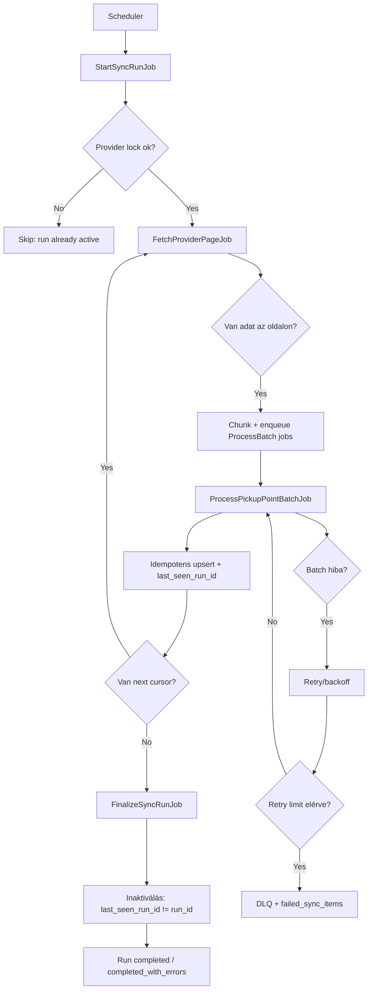

# 1. feladat: Átvételi pont szinkronizáció tervezés

## Cél
Több futárszolgáltató (provider) átvételi pontjainak megbízható, skálázható és idempotens szinkronizálása külső API-ból Laravel alapú, queue-orientált, elosztott rendszerben.

## Rövid architektúra

Komponensek:
- `Sync Orchestrator` (ütemezett indítás + run lifecycle)
- `Provider Fetcher` (külső API lapozott beolvasása)
- `Batch Processor` (transzformáció + upsert)
- `Run Finalizer` (run lezárás, törlendő/inaktiválandó rekordok kezelése)
- `Recovery Watchdog` (beragadt runok és munkák feloldása)

Táblák (javaslat):
- `sync_runs` (egy teljes provider szinkron futás metaadatai)
- `sync_run_checkpoints` (cursor/page checkpoint)
- `pickup_points` (kanonikus lokális állapot)
- `pickup_point_sync_state` (provider-specifikus hash, last_seen_run_id, external_updated_at)
- `failed_sync_items` (tartósan hibás elemek)

Queue-k:
- `sync-orchestrator`
- `sync-fetch`
- `sync-process`
- `sync-finalize`
- `sync-recovery`

## Folyamatvezérlés

1. `StartSyncRunJob(provider_id)` létrehoz egy új `sync_runs` rekordot `running` státusszal.
2. Job lockol provider szinten (pl. Redis lock), hogy egyszerre egy aktív run legyen providerenként.
3. `FetchProviderPageJob(run_id, cursor)` lapozva olvas külső API-ból.
4. Minden oldal kisebb chunkokra bomlik (pl. 500-1000 elem), és `ProcessPickupPointBatchJob` queue-ba kerül.
5. Batch worker:
   - normalizál
   - validál
   - idempotens upsertet futtat
   - frissíti `last_seen_run_id` mezőt
6. Fetcher a következő cursorral új `FetchProviderPageJob`-ot ad fel, amíg van adat.
7. Amikor az összes batch befejeződött: `FinalizeSyncRunJob(run_id)`:
   - az adott provider rekordjai közül, amelyek `last_seen_run_id != run_id`, inaktiválásra kerülnek
   - run státusz `completed` / `completed_with_errors`
8. Sikertelen batch esetén retry policy után DLQ/`failed_sync_items`, run `completed_with_errors` maradhat, nem blokkol teljesen.

## Nagy adatmennyiség kezelése (100k+)

- Teljes memória betöltés helyett folyamatos stream/lapozás.
- Korlátozott batch-méret, hogy worker memória/futásidő limitet tartsa.
- Provider szerinti partícionálás: több provider párhuzamosan futhat.
- Egy provideren belül kontrollált párhuzamosság (chunk queue), de finalizálás csak minden batch után.
- DB oldalon:
  - indexek: `(provider_id, external_id)` unique
  - részleges indexek aktív rekordokra
  - bulk upsert (`insert ... on conflict do update` / MySQL equivalent)
- Backpressure:
  - queue depth alapú throttling
  - API rate limit és exponential backoff

## Idempotencia biztosítása

- Determinisztikus kulcs: `(provider_id, external_id)`.
- Upsert csak akkor módosít, ha változott a hash vagy `external_updated_at`.
- `payload_hash` mentése a felesleges update-ek elkerülésére.
- Job szinten idempotencia kulcs: `run_id + batch_sequence` (duplikált queue üzenet nem okoz többszörös hatást).
- Run state tranzíciók atomikusan, optimistic lockkal vagy `where status = ...` guarddal.

## Hibakezelés és recovery

Átmeneti hibák:
- hálózati/API timeout, 429/5xx -> retry exponenciális backoff + jitter
- retry plafon után DLQ

Tartós/adatminőségi hibák:
- invalid payload -> `failed_sync_items` (external_id, hiba oka, payload snapshot)
- a többi rekord feldolgozása folytatódik (partial failure tolerancia)

Félbeszakadt folyamat:
- `sync_run_checkpoints` alapján újraindítás ugyanarról a cursorról
- watchdog `heartbeat` alapján `stalled` runokat felismer:
  - ha fetcher halt el: utolsó checkpointtól újra enqueue
  - ha process batchek maradtak: hiányzó batchek újra enqueue
- végső fallback: run `aborted`, új run indítható biztonságosan idempotens upsert miatt

## Állapotgép (run lifecycle)

`pending -> running -> finalizing -> completed`

Hibaágak:
- `running -> stalled -> running`
- `running/finalizing -> completed_with_errors`
- `running -> aborted`

## Observability (minimum)

- Metrikák:
  - run duration
  - records fetched/processed/failed
  - queue lag
  - retry count
- Log:
  - `run_id`, `provider_id`, `cursor`, `batch_id`, `external_id`
- Riasztás:
  - elhúzódó run
  - növekvő DLQ
  - ismétlődő provider API hibák

## Mermaid folyamatábra

## Miért működik jól ebben a környezetben

- Queue-first és horizontálisan skálázható.
- At-least-once delivery mellett is idempotens.
- Worker memória/futásidő limitet tiszteletben tartja (kis chunkok).
- Félbeszakadásnál checkpointos recovery biztosítja, hogy ne induljon nulláról.
